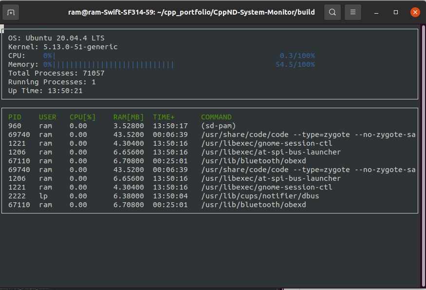

# Linux System Monitor

This Linux System Monitor is an inspiration from htop, a popular system monitor. This project code is written in C++ programming language using its Object Oriented Programming features such as Inheritance, Composition, Polymorphism etc.. A graphical display output library named _ncurses_ displays the system information in the terminal. The [starter code](https://github.com/udacity/CppND-System-Monitor) for this project is provided by Udacity as a part of C++ nanodegree program.



## ncurses
[ncurses](https://www.gnu.org/software/ncurses/) is a library that facilitates text-based graphical output in the terminal. This project relies on ncurses for display output.

Install ncurses within your Linux environment: `sudo apt install libncurses5-dev libncursesw5-dev`

## Make
This project uses [Make](https://www.gnu.org/software/make/). The Makefile has four targets:
* `build` compiles the source code and generates an executable
* `format` applies [ClangFormat](https://clang.llvm.org/docs/ClangFormat.html) to style the source code
* `debug` compiles the source code and generates an executable, including debugging symbols
* `clean` deletes the `build/` directory, including all of the build artifacts

## Instructions to clone and execute the code

1. Clone the project repository: `git clone https://github.com/ram-ravan/Linux-System-Monitor.git`

2. To compile the project, first, create a `build` directory and change to that directory:
```
mkdir build && cd build
```
From within the `build` directory, then run `cmake` and `make` as follows:
```
cmake ..
make
```

3. Build the project: `make build`

4. Run the resulting executable: `./build/monitor`